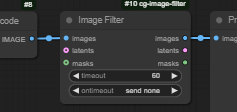

# CG Image Filter

A set of four nodes designed to pause execution of the workflow to allow you to make selections and/or edits before continuing.
There's an example workflow that illustrates all of them at the end.

- ['Image Filter'](#image-filter) - pause the flow and pick which images from a set you want to proceed with
- ['Mask Image Filter'](#mask-image-filter) - launch the mask editor for the image, and return the image and mask
- ['Text Image Filter'](#text-image-filter) - show the image with some editable text which is returned
- ['Text Image Filter with Extras'](#text-image-filter-with-extras) - as 'Text Image Filter' but with three extra single line texts fields that are also returned

*Update* 'Text Image Filter' and 'Text Image Filter with Extras' are now identical, and the extra text fields have been added to 'Image Filter' as well

There's also a helper node, 'Split String by Commas' that can be used if you want more extra values.

*New in 1.2*

- Options have all moved to the main settings
- New option to show a miniature window instead of taking over the screen - click on it to go into full screen mode

*New in 1.1.6* 

- `Pick from List` to allow you to select matching items from any list
- `Batch from Image List` and `Image List from Batch` to work with image batches
- hover mouse over image and press space to zoom, space again to close the zoom

## Examples of what you might do with them

- Generate an image or batch, and select which ones you want before spending the time upscaling
- Generate an image and pick part of it to inpaint all in one go (the example workflow below does this)
- Edit auto-generated captions before saving them
- Iterate through a folder of images, picking a masked area to inpaint (and the inpainting prompt) for each
- you ideas here...

---

## Global Options

- **AutosendIdentical** In the ImageFilter node, if all images are identical (including if there is just one image) then send
an image without user interaction. 
- **ClickSends** In the ImageFilter node, clicking an image sends it instead of selecting it. Useful if you know you only ever want to send one image at most.
- **PlaySound** Play a 'ding' sound when any of the filter nodes becomes active.
- **SmallWindow** Instead of taking over the whole screen immediately, display a tiny version of the image in the top left. Click that image to go into the full screen mode.

## Image Filter

The image filter node pauses execution of the workflow while you choose which, if any, of the images produced, you want to progress.

Insert it like this:

When you run the workflow, and get to this point, a popup window will appear displaying the image(s) for you to select which, if any, 
you want to progress:

Click the images that you want to keep (their border will turn green) and then click 'Send' (or press 's') to continue the workflow. 
If you don't want to keep any of the images, click 'Cancel' (or press 'x') to terminate the workflow. 

The node also has a timeout specified, and a countdown is shown on the left hand side. If you don't Send or Cancel before the timeout, 
the node will either cancel or send all the images, depending on the option you have selected.

Here's a simple use: generate a batch of images and pick which ones you want to save:

### Checkboxes

- 'Click to send': clicking an image also sends it
- 'autosend one if identical': automatically send a single image if all the images are identical

### Optional inputs

The Latent and Mask inputs are optional. If used, they should have the same number of latents (or masks) as the image batch, 
and the latents (or masks) corresponding to the selected images will be output. Use this if (for instance) you want to 
select from a batch of images, but the next stage uses the latent - that way you avoid the decode-recode loss, or if you want
to pick a mask (perhaps from options automatically generated)

---

## Mask Image Filter

Designed for a single image, when executed the Mask Image Filter node will automatically launch the mask editor. 

When you finish mask editing the image and mask will be output. Here's a simple use - generate an image, and then 
mask the bit you don't like, before doing an img2img step.

Again, there is a timeout, and if you don't save a mask before the end of the timeout (or if you press the cancel button in the mask editor), 
it will either cancel, or send a blank mask, depending on the option chosen.

---

## Text Image Filter

Also designed for a single image, this node will show the image and a string of text; you can edit the text and then press send. 

The image and (edited) text are output. The intended use is for captioning workflows; you can read and edit each caption as it is
generated. Here's a trivial workflow:

---

# A few more things

## Extras

'Text Image Filter' and 'Image Filter', each provide three extra text fields, intended for short form - like specifying the denoising you want on the next step, or a prefix to save the file with.

Some helpers are provided - a node that splits a string by a divider, and nodes to convert the string to an int or a float.

If you use the optional 'tip' input, the contents will be displayed under the extras input fields, so you can remind yourself what they are for!

---

## Pick from List

The `Image Filter` node outputs a string, `indexes`, which is a comma separated list of the indexes (0 based) of the images selected. Connect this to a `Pick from List` node, and connect a list of anything to the `anything` input, and the `Pick from List` node will output a list corresponding to the selected images.

For instance, if you create a set of images using a list of prompts, this can be used to select the prompts that correspond to the selected images. But you might well want to batch the images if you did use lists - see below.

So something like this:

---

## Batch and List

If you are using lists, each node will run once for each list. This means that normally you will want a single batch of images for the `Image Filter` (so if you generate a load of images using lists of, for instance, prompts, you will want to combine them with the helper node `Batch from Image List`)

If you generate a batch of images and want to use the `Mask Image Filter` or `Text Image Filter`, which only show a single image, you will want to do the opposite - convert the batch to a list with `Image List From Batch`. Then the images will be shown sequentially.

---

# Example Workflow

This workflow:
- generates an image
- uses 'Mask Image Filter' to allow you to mask part of the image for inpainting
- uses 'Text Image Filter with Extras' to enter a prompt (and negative prompt) for the inpainting
- inpaints
- uses 'Image Filter' to choose which, if either, of the two images (before and after inpaint) to save

The workflow is embedded in this seahorse in a bottle:

# Bugs, Ideas, and the future

Take a look at the [issues list](https://github.com/chrisgoringe/cg-image-filter/issues) to see what I'm thinking of,
to report problems, or to make suggestions.